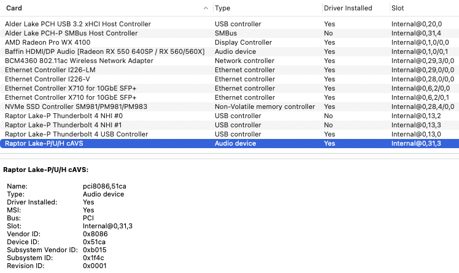

# Minisforum MS-01 with Opencore 1.0.3

  
 

 

  
 

 

  
 

 

  
 

 

  
 

  

  
 

## Specs
| **Component** | **Model** |
| ------------- | --------- |
| CPU | i9-13900H 6P/8E cores and 20 threads @4.1GHz E-Cores @5.4GHz P-Cores |
| RAM | 2x48GB 5600MHz DDR5 SO-DIMM Crucial CT48G56C46S5.M16B1 |
| Audio Chipset | Realtek ALC269. Not working currently |
| dGPU | Dell AMD Radeon Pro WX4100 4GB. Works OOB |
| WiFi & Bluetooth | Fenvi BCM94360NG. Works OOB |
| OS Disk | 512GB Samsung 970 Pro |
| macOS | Ventura 13.7.2 (22H313)/OpenCore 1.0.3

## BIOS
- Press Del to enter the BIOS. Use latest available bios for the system 1.26
- All settings can be enabled pretty much that are needed for Windows/Linux to work efficiently

## Installation instructions
- Adjust your config according to your GPU. I am using a "natively" supported GPU.
- Generate your own SMBIOS obviously. The one in the config now is just a sample for installation purposes only. Do not use it in your system.

## Issues
1. Sound - for some reason driver is not loaded and I have no sound in the system, except through Bluetooth.
UPD. Could not get AppleALC working, so I tried VoodooHDA extension and I have sound that way. Not ideal, but it works.
2. LAN interfaces - currently I am not using any third party kexts. Interfaces work OOB with native Apple driver, but that limints the speed to 1Gb.